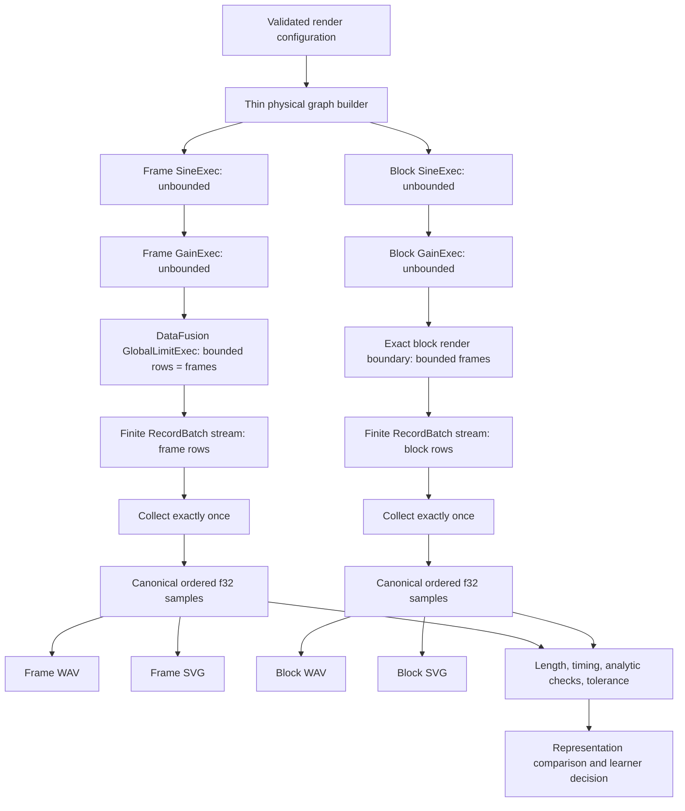
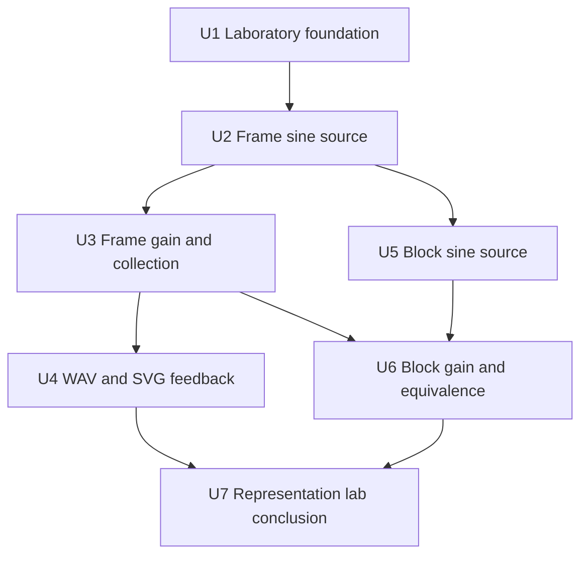

# feat: Build the Physical Audio Representation Lab

## Overview

Build SonicFusion's first learner-owned vertical slice: two layout-specific DataFusion physical graphs whose mono sine sources are unbounded, whose gain nodes preserve that streaming character, and whose bounded render roots produce the same finite offline result. Each bounded layout root executes once, is collected once, and produces a WAV file plus a headless SVG waveform. The collected signals are canonicalized and compared before the learner records a representation decision.

This plan covers milestone one only. Later `TableProvider`, stateful DSP, logical-node lowering, and optimizer work remains explicitly tracked rather than being anticipated through speculative abstractions (see origin: `docs/brainstorms/2026-08-29-datafusion-sound-engine-requirements.md`).

The implementation posture is learning-first and test-guided. The assistant may explain one concept, offer a narrow API sketch or test scaffold, and review/debug the learner's work; the learner authors the complete execution nodes and the final representation conclusion.

---

## Problem Frame

SonicFusion exists to teach Apache DataFusion internals and foundational DSP through software that can be heard and inspected. The first milestone must make DataFusion's physical execution and Arrow batch semantics concrete without adding SQL, logical planning, real-time scheduling, or advanced audio processing too early.

There are no established project patterns to extend: `src/lib.rs` is Cargo-generated scaffolding, and `Cargo.toml` has no dependencies. The plan therefore creates a deliberately small laboratory whose abstractions are allowed to remain layout-specific until the experiment produces evidence.

---

## Requirements Trace

**Active in this plan**

- R1–R3. Preserve learner ownership, bounded pair-programming assistance, and a teaching-style review after milestone one.
- R4. Model the mono sine oscillator as an unbounded source, process it through gain, and end in a bounded physical render plan; reuse DataFusion's `GlobalLimitExec` where one row equals one audio frame.
- R5. Compose custom DataFusion physical nodes through a small Rust builder; do not require logical planning or SQL.
- R6. Implement frame-per-row and block-per-row Arrow layouts independently.
- R7. Preserve order, phase, and processing behavior across multiple RecordBatches.
- R8. Execute and collect once per layout; both artifact writers consume that layout's same materialized result.
- R9. Compare timing, frame count, and samples using a predetermined tolerance and an analytic signal oracle.
- R10. Record the representation trade-offs and resulting decision.

**Preserved as follow-up work, not implemented here**

- R11. Add square and file-backed sources through `TableProvider` exercises.
- R12. Progress to stateful filters, distortion, and mixing.
- R13. Produce domain-specific logical nodes and lower them through a DataFusion `ExtensionPlanner` into physical nodes.
- R14. Fuse adjacent gain nodes with a physical optimizer rule and verify semantic equivalence.
- R15. Add frequency-domain visualization with filter and distortion work.
- R16. Make separate educational-value/feasibility decisions for SQL, streaming fan-out, and real-time playback.

**Origin flows:** F1 (representation experiment), F2 (guided learning cycle)

**Origin acceptance examples:** AE1 (multi-batch audible/visual render), AE2 (cross-layout equivalence), AE3 (learner explains the representation choice), AE4 (deferred gain-fusion optimizer behavior)

---

## Scope Boundaries

- Milestone-one artifacts are finite, offline, mono, and single-partition; generated oscillator sources remain unbounded until a physical render boundary bounds the graph.
- The core time domain is integer frame indices, not floating-point elapsed time.
- No `TableProvider`, custom logical node, `ExtensionPlanner`, optimizer rule, SQL surface, live audio device, streaming tee, mixer, filter, distortion, sample loader, stereo abstraction, or benchmark is introduced.
- The frame and block implementations may duplicate small amounts of code when that makes their ergonomic differences visible.
- WAV and SVG output validate feedback paths; direct floating-point samples—not artifact bytes or pixels—are the correctness oracle.
- A DAW, plugin format, MIDI/sequencer system, and production-grade engine remain outside the current scope.

### Deferred to Follow-Up Work

The checklist below is a roadmap, not an invitation to add extension hooks during milestone one:

- [ ] Square oscillator and an explicit aliasing lesson (R11).
- [ ] Generated-source and file-backed `TableProvider` implementations (R11).
- [ ] Stateful low-pass filter with cross-batch continuity tests and a frequency-domain view (R12, R15).
- [ ] Distortion with harmonic inspection, followed later by mixing after timing/channel/duration alignment is specified (R12, R15).
- [ ] Domain-specific logical nodes produced by the Rust builder and lowered by a DataFusion `ExtensionPlanner` into the existing physical nodes (R13).
- [ ] Physical optimizer rule for adjacent-gain fusion, including before/after plan inspection and tolerance-based output equivalence (R14, AE4).
- [ ] Explicit decision on whether SQL adds learning value after the logical planner exists (R16).
- [ ] Explicit decision on whether to add a buffered streaming multi-sink tee (R16).
- [ ] Real-time playback feasibility spike that keeps DataFusion work off the hard real-time callback thread (R16).
- [ ] Capture milestone-one DataFusion/Arrow/DSP lessons under `docs/solutions/` after the experiment concludes.

---

## Context & Research

### Relevant Code and Patterns

- `Cargo.toml` contains only package metadata and needs a reproducible toolchain/dependency baseline.
- `src/lib.rs` contains generated `add` code and one generated test; it is not an architectural precedent.
- `.gitignore` already ignores `target/`, so human-run representation artifacts can live under `target/sonic-fusion/representation-lab/` without new broad ignore rules.
- `docs/brainstorms/2026-08-29-datafusion-sound-engine-requirements.md` is the sole authoritative project design artifact.
- No `docs/solutions/`, CI, examples, integration tests, or established module layout exists.

### Institutional Learnings

- No prior learning documents exist in this repository.
- The first representation decision, DataFusion API lessons, and batch-boundary pitfalls should be compounded after the milestone rather than treated as undocumented session knowledge.

### External References

- DataFusion `54.1.0` crate metadata and Rust `1.88` requirement: https://crates.io/crates/datafusion/54.1.0
- Versioned `ExecutionPlan` API: https://docs.rs/datafusion/54.1.0/datafusion/physical_plan/trait.ExecutionPlan.html
- Versioned `PlanProperties` API: https://docs.rs/datafusion/54.1.0/datafusion/physical_plan/struct.PlanProperties.html
- Physical-plan stream module: https://docs.rs/datafusion/54.1.0/datafusion/physical_plan/stream/index.html
- DataFusion pull-based execution and bounded intermediate-working-set overview: https://datafusion.apache.org/user-guide/arrow-introduction.html
- Current custom table-provider guidance for the follow-up milestone: https://datafusion.apache.org/blog/2026/03/31/writing-table-providers/
- Current custom logical/physical extension guidance for the follow-up milestone: https://datafusion.apache.org/blog/2026/01/12/extending-sql/
- Versioned physical optimizer rule API for the later fusion milestone: https://docs.rs/datafusion/54.1.0/datafusion/physical_optimizer/trait.PhysicalOptimizerRule.html
- WAV support: https://docs.rs/hound/3.5.1/hound/

---

## Key Technical Decisions

- **Pin DataFusion `=54.1.0` and declare Rust `1.88`:** `54.1.0` is a recent patch release with versioned documentation and without the transitional `ExecutionPlan` deprecations introduced in `55.0.0`. The local Rust toolchain already exceeds its MSRV. Exact pinning prevents tutorial snippets from silently changing.
- **Keep supporting dependencies explicit and narrow:** Use Tokio `=1.52.4` with only `macros` and `rt-multi-thread`, `futures = =0.3.31` plus `async-stream = =0.3.6` for lazy stream construction/utilities, `hound = =3.5.1` for float WAV, `thiserror = =2.0.20` for contextual project errors, and dev-only `tempfile = =3.20.0`. Commit `Cargo.lock`. Do not add direct Arrow or `async-trait` dependencies unless compilation against DataFusion `54.1.0` proves they are required. (`cargo check` confirmed DataFusion `54.1.0` requires Tokio `^1.52`.)
- **Use DataFusion's matching Arrow types:** Import Arrow through DataFusion's public common/Arrow surface where possible; add a direct Arrow dependency only if the pinned API requires it. This avoids mismatched Arrow major versions.
- **Use `f32` samples:** It matches common audio buffers and makes Arrow `Float32` the shared sample type. Signal generation may compute phase in `f64` before converting to `f32`.
- **Make `frame_count` authoritative at the render boundary:** An unbounded oscillator has no terminal frame. The frame layout uses `GlobalLimitExec(skip = 0, fetch = frame_count)` because one row equals one audio frame; the block layout must enforce the same half-open `0..frame_count` result in audio-frame units rather than row units.
- **Bound the materialized lab by time:** A separate whole-second render limit defaults to 60 seconds and is caller-configurable. This is a render-plan construction guardrail, not source semantics, not a substitute for DataFusion's memory pool, and not an automatically spillable allocation. Validate `frame_count <= sample_rate × max_render_seconds` with checked arithmetic before graph construction; raising the limit is an explicit opt-in to larger in-memory vectors and artifacts.
- **Use a known analytic signal:** Initial phase is zero and sample `n` is `gain * sin(2π × frequency × n / sample_rate)`. Production sine generation is unit-tested at known points before either Arrow layout depends on it.
- **Validate a narrow domain:** Sample rate, frame count, batch capacity, and maximum render seconds are positive; frequency and gain are finite; frequency is non-negative and below Nyquist. Negative gain is valid. Values outside `[-1, 1]` remain valid engine samples and are not silently normalized.
- **Use absolute frame position, not mutable phase accumulation:** Every batch derives samples from global frame indices. This isolates the representation/batching lesson; recursive oscillator state can be a later exercise.
- **Frame layout:** non-null `frame: UInt64` and `sample: Float32`; each RecordBatch holds at most `batch_frame_capacity` frames.
- **Block layout:** non-null `start_frame: UInt64` and `samples: List<Float32>`; each row is at most `block_frames` samples. A final short row is represented as a shorter variable list, never silently padded. For the lab, `batch_frame_capacity` is a multiple of `block_frames`, so one RecordBatch contains several block rows with aligned temporal capacity.
- **Keep audio metadata out of ordinary rows:** Both schemas use exactly `audio.sample_rate_hz` (canonical base-10 unsigned integer string), `audio.channels` (`"1"`), and `audio.layout` (`"frame"` or `"block"`). Sources emit them, gain nodes preserve them unchanged, and decoders validate them against configuration and selected layout. Repeating metadata in every row would distort the representation comparison.
- **Distinguish source and render boundedness:** Oscillator sources advertise `UnknownPartitioning(1)`, incremental emission, and `Unbounded { requires_infinite_memory: false }`; finite render roots advertise bounded output. `GlobalLimitExec` provides that boundary for frame rows, including final-batch slicing and early input drop. Every custom node rejects unsupported partition indices and preserves temporal order. `EquivalenceProperties` may declare frame/start-frame ordering only after a monotonic-output test. Stream cursors belong to each `execute` call, never to the shared `ExecutionPlan`, so repeated executions are independent.
- **Predetermine equality policy:** Canonical vectors must have identical lengths, contain only finite samples, and satisfy `abs_diff <= max(1e-7, 1e-5 × max(abs(left), abs(right)))`; failures report the first frame mismatch and both magnitudes. Selected samples also match the analytic sine/gain oracle, and non-zero test signals separately prove an appropriate peak magnitude so an all-zero result cannot hide below the absolute floor.
- **Use a thin builder, not a generalized audio framework:** The builder selects a layout and composes concrete nodes. The frame tree is `SineExec -> GainExec -> GlobalLimitExec`; the block tree uses the simplest exact render boundary established in U5. `RenderConfig` may aggregate graph settings, but each custom node retains only its own source, processor, or render concerns. Shared interfaces stop at immutable configuration, physical-plan traits, and canonical sample output.
- **Write floating-point WAV and plain SVG:** `hound 3.5.1` writes mono 32-bit float WAV without hidden normalization. A small project-owned SVG writer avoids a plotting stack and works headlessly. Human-run files go under `target/sonic-fusion/representation-lab/`; tests use temporary directories.
- **One bounded collection per layout:** Never call top-level `collect` on an unbounded oscillator or gain root. Collect each bounded render root once, convert its batches to one ordered sample vector, and let both output writers consume that vector. The comparison executes the second bounded root independently; it does not introduce shared streaming fan-out.

---

## Open Questions

### Resolved During Planning

- **DataFusion version:** Pin `=54.1.0` with `rust-version = "1.88"`; avoid fresh `55.0.0` trait transitions and older `50.3.0` unless implementation reveals an upstream defect.
- **Frame-count semantics:** Oscillators are unbounded; explicit integer `frame_count` and half-open `0..frame_count` semantics belong to bounded render plans. In the frame layout, DataFusion row count and audio-frame count are identical.
- **Candidate schemas:** Use `UInt64 + Float32` frame rows and `UInt64 + List<Float32>` block rows, with schema metadata for sample rate/channel/layout.
- **Final block behavior:** Emit an unpadded variable-length final block.
- **Correctness oracle:** Zero-phase absolute-frame sine calculation, a hand-derived one-cycle fixture that does not call production signal math, and the named combined absolute/relative sample policy.
- **Collection wording:** Exactly one execution/collection per candidate layout; both artifacts for that layout share its result.
- **Default demonstration:** 48,000 Hz, 48,000 frames, 440 Hz, gain `0.5`, batch capacity 1,024 frames, and 128-frame nested blocks. A configurable whole-second limit defaults to 60 seconds. Tests use deliberately small/non-divisible frame counts to exercise several batches and the final partial block.
- **Outputs:** Mono 32-bit float WAV through `hound`; deterministic project-owned SVG; no GUI plotting dependency.
- **Physical property baseline:** In DataFusion `54.1.0`, construct `PlanProperties` from schema-backed `EquivalenceProperties`, `UnknownPartitioning(1)`, incremental emission, and boundedness. Add declared ordering through `EquivalenceProperties` only together with monotonic frame/start-frame tests; do not make an unverified optimizer claim.

### Deferred to Implementation

- **Exact helper and error type names:** Let the learner choose clear names while preserving the contracts in this plan.
- **Arrow list-builder mechanics:** Resolve while implementing the block layout without changing its schema contract or final-partial-block rule.
- **SVG downsampling/window presentation:** Choose a simple deterministic policy that makes a 440 Hz waveform visible; sample correctness remains separately tested.
- **Later stateful processor state model:** Design only when the low-pass milestone begins. Do not create a generic state framework now.

---

## Output Structure

```text
Cargo.toml
README.md
examples/
  representation_lab.rs
src/
  lib.rs
  builder.rs
  config.rs
  dsp/
    mod.rs
    sine.rs
  layout/
    mod.rs
    frame.rs
    block.rs
  physical/
    mod.rs
    frame/
      mod.rs
      sine.rs
      gain.rs
    block/
      mod.rs
      sine.rs
      gain.rs
  render.rs
  output/
    mod.rs
    wav.rs
    waveform.rs
  lab.rs
tests/
  render_config.rs
  frame_execution.rs
  batch_continuity.rs
  output_artifacts.rs
  block_execution.rs
  representation_equivalence.rs
  representation_lab.rs
docs/
  brainstorms/2026-08-29-datafusion-sound-engine-requirements.md
  plans/2026-08-29-001-feat-audio-representation-lab-plan.md
  representation-comparison.md
```

This tree is a scope declaration, not a mandate to preserve empty modules or split tiny files prematurely. Feature-bearing files and their tests remain authoritative in the units below.

---

## High-Level Technical Design

> *This illustrates the intended approach and is directional guidance for review, not implementation specification. The implementing learner should treat it as context, not code to reproduce.*



Each `ExecutionPlan` is immutable. Each `execute(0, ...)` creates a fresh stream with its own next-frame cursor. This prevents repeated or concurrent execution from sharing oscillator state.

---

## Implementation Units

The units form the learning sequence. Do not start the next unit until its behavioral checks pass and its learner check completes: before execution, the learner predicts one relevant schema, plan, sample, or batch-boundary outcome; afterward, they interpret the actual result in their own words. If the explanation exposes a misconception, add one focused example or test and keep the unit open. Only milestone-level lessons and unresolved questions are persisted in `docs/representation-comparison.md`.



- [x] U1. **Establish the reproducible laboratory and DSP oracle**

**Goal:** Replace generated scaffolding with validated render configuration and resource limits, a known-correct finite sine primitive, and pinned minimal dependencies.

**Requirements:** R1, R2, R4, R7, R9; F2

**Dependencies:** None

**Files:**
- Modify: `Cargo.toml`
- Modify: `Cargo.lock`
- Modify: `src/lib.rs`
- Create: `src/config.rs`
- Create: `src/dsp/mod.rs`
- Create: `src/dsp/sine.rs`
- Test: `tests/render_config.rs`
- Test: `src/dsp/sine.rs` (focused unit tests)

**Approach:**
- Rename the package to `sonicfusion`, following DataFusion's crate-name convention; declare Rust `1.88` and add the exact direct dependency set from Key Technical Decisions with only the stated features. Verify the build before considering any direct Arrow or `async-trait` dependency.
- Use a small handwritten fallible configuration builder whose no-argument build produces the demonstration preset. Treat authoritative `frame_count`, sample rate, batch-frame capacity, oscillator frequency, gain, and a configurable whole-second render limit as one cross-field validation boundary. Default the limit to 60 seconds and compare frames with `sample_rate × max_render_seconds` using checked arithmetic.
- Define a pure zero-phase sine-at-absolute-frame primitive. Test it before using Arrow or DataFusion against a hand-derived one-cycle fixture so later layout comparisons have an independent mathematical anchor.

**Execution note:** Implement configuration validation and signal math test-first. The assistant may supply the sine equation or one assertion helper; the learner owns the production types and implementation.

**Patterns to follow:**
- Origin boundaries in `docs/brainstorms/2026-08-29-datafusion-sound-engine-requirements.md`.
- Exact versioned APIs under the DataFusion `54.1.0` docs, not examples from `latest` or another major.

**Test scenarios:**
- Happy path: 48,000 Hz, 48,000 frames, 1,024-frame batches, 440 Hz, and gain `0.5` construct a valid configuration.
- Happy path: frame zero produces zero; a frequency/sample-rate pair with an exact quarter-cycle sample produces the expected signed peak under the named sample-comparison policy.
- Edge case: the last valid frequency below Nyquist is accepted; Nyquist and higher are rejected under the milestone-one policy.
- Edge case: negative finite gain is accepted and changes polarity; gain above one remains valid engine data.
- Resource boundary: at 48,000 Hz the default limit accepts 2,880,000 frames and rejects 2,880,001; a caller-supplied smaller or larger whole-second limit changes that boundary predictably.
- Error path: zero sample rate, zero frame count, zero batch capacity, zero maximum seconds, overflow while deriving the frame limit, negative/non-finite frequency, and non-finite gain produce focused validation errors.

**Verification:**
- The crate builds without the package-name warning, configuration errors are deterministic, and known sine samples pass.
- The learner can explain sample rate, frame index, phase, amplitude/gain, Nyquist, and why integer frame count avoids duration-rounding ambiguity.

---

- [x] U2. **Implement the frame-per-row sine source and finite limit**

**Goal:** Learn an unbounded custom DataFusion leaf `ExecutionPlan`, then reuse DataFusion's standard physical row limit as an exact audio-frame boundary.

**Requirements:** R4, R5, R6, R7; AE1

**Dependencies:** U1

**Files:**
- Create: `src/layout/mod.rs`
- Create: `src/layout/frame.rs`
- Create: `src/physical/mod.rs`
- Create: `src/physical/frame/mod.rs`
- Create: `src/physical/frame/sine.rs`
- Modify: `src/lib.rs`
- Test: `tests/frame_execution.rs`
- Test: `tests/batch_continuity.rs`

**Approach:**
- Define the explicit `frame: UInt64, sample: Float32` schema with `audio.sample_rate_hz`, `audio.channels = "1"`, and `audio.layout = "frame"` metadata exactly as specified in Key Technical Decisions.
- Implement an immutable one-partition unbounded sine leaf. `execute(0)` creates a fresh stream-local cursor, emits full batches indefinitely from absolute frame numbers, and retains no prior batches; `execute(1+)` returns a clear error.
- Wrap the source in DataFusion's `GlobalLimitExec` with zero rows skipped and a checked `u64`-to-`usize` conversion of `frame_count` as its fetch value. Because each row is one frame, the standard operator must stop at the exact audio-frame count, slice the final batch, drop the source stream early, and report bounded output without custom limit code.
- Expose enough plan display/properties information for inspection without building a general metrics framework.

**Execution note:** Start from stream behavior tests. The assistant may sketch the responsibilities of `ExecutionPlan` or one `PlanProperties` fragment, but not provide the complete node.

**Patterns to follow:**
- DataFusion `54.1.0` `ExecutionPlan` contract and `RecordBatchStreamAdapter`/stream utilities.
- Immutable plan / per-execution state separation described in this plan's technical design.

**Test scenarios:**
- Source behavior: polling three batches from an 8 Hz / 2 Hz oscillator with capacity 4 yields full frame ranges `0..4`, `4..8`, and `8..12`; dropping the stream stops consumption.
- Covers AE1. Limit behavior: wrapping that source with `GlobalLimitExec(fetch = 10)` emits three batches containing 4, 4, and 2 rows with frame values `0..10`, then ends.
- Happy path: schema fields, nullability, data types, and all metadata keys/encodings exactly match the frame-layout contract; alternate spellings or non-canonical numeric strings fail validation.
- Boundary: samples immediately before and after each batch boundary match the absolute-frame sine oracle under the named sample-comparison policy.
- Error path: requesting partition 1 fails rather than duplicating or reordering audio.
- Independence: executing the same oscillator twice yields identical prefixes beginning at frame zero; two limit-root executions each produce a complete independent finite result.
- Plan semantics: inspection reports one output partition, an unbounded finite-memory oscillator, and a bounded `GlobalLimitExec` root; emitted frame indices are monotonic.

**Verification:**
- An unbounded multi-batch source produces a continuous frame prefix exactly once per execution, and DataFusion's standard limit produces the requested finite render without a SonicFusion-specific frame-limit node.
- The learner can explain `ExecutionPlan`, `PlanProperties`, partition execution, stream polling, and why a RecordBatch can itself be a DSP chunk.

---

- [ ] U3. **Add frame gain, collection, and canonical samples**

**Goal:** Learn a custom unary physical node and establish the collect-once boundary for the frame layout.

**Requirements:** R4, R5, R7, R8, R9; AE1

**Dependencies:** U2

**Files:**
- Create: `src/physical/frame/gain.rs`
- Create: `src/render.rs`
- Modify: `src/physical/frame/mod.rs`
- Modify: `src/lib.rs`
- Test: `tests/frame_execution.rs`
- Test: `tests/batch_continuity.rs`

**Approach:**
- Wrap one child plan, preserve the frame column, batch boundaries, and schema metadata unchanged, and multiply only the sample column.
- Preserve compatible child schema, partitioning, ordering, and boundedness claims; reconstruct the node when DataFusion supplies a replacement child.
- Execute the child once per gain execution and map its stream without materializing inside the operator.
- Add a frame-layout decoder that accepts the validated render configuration, validates that decoded frame indices cover exactly `0..frame_count`, and converts one collected batch vector into canonical ordered `Vec<f32>` samples. Zero batches, zero decoded samples, and premature end are contextual errors because milestone-one configuration rejects zero frame count.

**Execution note:** Implement gain behavior and child-replacement tests before wiring the collector. The assistant may provide one Arrow downcast or stream-map snippet; the learner owns the node.

**Patterns to follow:**
- Unary-node child semantics in the pinned `ExecutionPlan` API.
- One state owner per stream; no cursor or collected buffer on the shared plan.

**Test scenarios:**
- Happy path: gain `0.5` scales positive, negative, and zero samples while preserving frame values, row counts, and exact schema metadata.
- Edge case: gain `0.0` yields signed/unsigned zero values acceptable under policy; negative gain inverts polarity.
- Scale coverage: representative small (`1e-4`) and high-magnitude (`1e4`) finite gains exercise the combined tolerance and explicit peak-magnitude checks.
- Boundary: a three-batch input remains three ordered output batches with no duplicate or omitted frames.
- Error path: a wrong schema or unexpected nullable/type layout is rejected with context instead of panicking.
- Child replacement: replacing the input yields a valid gain plan with properties derived from the new child.
- Independence: repeated gain executions do not reuse an exhausted child stream.
- Collection: the frame decoder detects duplicate, missing, or out-of-order frame values and rejects zero batches, zero samples, or any final length other than the configured `frame_count`.
- Truncation: a stream that ends early reports the first missing absolute frame rather than returning a shorter successful vector.

**Verification:**
- The frame `sine -> gain` physical tree is inspectable and yields a canonical sample vector after exactly one top-level collection.
- The learner can explain leaf versus unary plans, `with_new_children`, lazy stream transformation, and the location of materialization.

---

- [ ] U4. **Produce WAV and waveform feedback from one render**

**Goal:** Turn one canonical sample vector into audible and visual artifacts without rerunning the DataFusion plan.

**Requirements:** R4, R8; AE1

**Dependencies:** U3

**Files:**
- Create: `src/output/mod.rs`
- Create: `src/output/wav.rs`
- Create: `src/output/waveform.rs`
- Modify: `src/lib.rs`
- Test: `tests/output_artifacts.rs`

**Approach:**
- Write mono 32-bit float WAV with the configured sample rate and no automatic gain normalization.
- Generate deterministic, headless SVG from a documented sample window/downsampling policy. Keep SVG production small and project-owned.
- Write to caller-provided paths. Human examples use `target/sonic-fusion/representation-lab/`; tests use temporary directories.
- Treat either writer failure as milestone failure, but preserve the architectural rule that a writer never re-executes the source plan.

**Execution note:** The assistant may provide the small `hound` format configuration or SVG coordinate formula; the learner owns writer functions and error handling.

**Patterns to follow:**
- Artifact conversion consumes canonical samples rather than Arrow layout-specific arrays.
- Output checks complement but never replace sample-level correctness tests.

**Test scenarios:**
- Covers AE1. Integration: one collected 440 Hz frame-layout render produces a playable-format WAV and a non-empty SVG in a temporary directory.
- WAV contract: header reports one channel, 48,000 Hz, 32-bit float samples, and exactly the configured frame count.
- Signal preservation: decoded WAV float samples match the canonical samples within the encoding tolerance and are not silently normalized.
- SVG contract: output is valid text with non-zero dimensions and a non-empty waveform path/polyline; avoid brittle full-file snapshots.
- Error path: an unwritable/invalid destination returns a useful error and does not attempt to execute a plan.
- Rerun: writing the same named human artifact follows one documented overwrite policy so stale files cannot masquerade as a new success.

**Verification:**
- One in-memory frame render produces both required artifacts, and tests independently verify artifact metadata and sample correctness.
- The learner can explain why output sinks sit after collection in milestone one and what a later streaming tee would add.

---

- [ ] U5. **Implement the block-per-row source and exact render boundary**

**Goal:** Rebuild the unbounded source with one nested processing block per Arrow row, then establish the simplest exact audio-frame boundary after demonstrating why a generic Arrow row limit is insufficient by itself.

**Requirements:** R4, R5, R6, R7, R10; AE2, AE3

**Dependencies:** U2

**Files:**
- Create: `src/layout/block.rs`
- Create: `src/physical/block/mod.rs`
- Create: `src/physical/block/sine.rs`
- Modify: `src/physical/mod.rs`
- Modify: `src/lib.rs`
- Test: `tests/block_execution.rs`
- Test: `tests/batch_continuity.rs`

**Approach:**
- Define `start_frame: UInt64, samples: List<Float32>` with the same canonical sample-rate/channel keys as the frame schema and `audio.layout = "block"`.
- Add a positive `block_frames` setting constrained to divide `batch_frame_capacity` for this laboratory.
- Emit full block rows indefinitely from the oscillator. First demonstrate that `GlobalLimitExec` counts block rows rather than nested samples. Then choose the smallest plan-local exact boundary supported cleanly by the pinned APIs: compose standard operators if they can truncate the final nested list transparently, otherwise implement a block-specific node. In either case, stop at the requested audio-frame count and represent the final remainder as a shorter list.
- Keep this implementation visibly separate from the frame source rather than hiding both behind a generalized layout framework.

**Execution note:** Build list construction and flattening incrementally. The assistant may sketch Arrow list offsets/values for one batch; the learner authors the source plan and stream.

**Patterns to follow:**
- The same immutable-plan/per-execution-cursor rule used by `src/physical/frame/sine.rs`.
- Exact DataFusion/Arrow versions selected in U1.

**Test scenarios:**
- Happy path: 10 frames, 4-frame blocks, and 8-frame batch capacity emit two RecordBatches; block starts are 0, 4, and 8 with list lengths 4, 4, and 2.
- Happy path: schema fields, nested child type/nullability, and metadata match the block-layout contract.
- Boundary: flattened samples around both row and RecordBatch boundaries match the analytic sine oracle.
- Final partial block: the remainder is present exactly once and is not zero-padded.
- Error path: zero block size, block size larger than batch capacity, non-dividing block/batch capacity, and partition 1 are rejected clearly.
- Independence: two executions start at frame zero and produce independent streams.
- Plan semantics: the source reports one unbounded finite-memory partition, the selected render root reports bounded output, and both preserve monotonic `start_frame` values.

**Verification:**
- The block source preserves exactly the same time-domain signal while exposing materially different Arrow construction and inspection ergonomics.
- The learner can explain Arrow list offsets/values, the difference between an Arrow row and a RecordBatch, and two distinct meanings of “block.”

---

- [ ] U6. **Add block gain, the physical builder, and cross-layout equivalence**

**Goal:** Complete both physical trees, provide the first Rust builder, and prove that representation—not sound—is the experiment variable.

**Requirements:** R4–R10; F1; AE2, AE3

**Dependencies:** U3, U5

**Files:**
- Create: `src/physical/block/gain.rs`
- Create: `src/builder.rs`
- Modify: `src/physical/block/mod.rs`
- Modify: `src/render.rs`
- Modify: `src/lib.rs`
- Test: `tests/block_execution.rs`
- Test: `tests/representation_equivalence.rs`

**Approach:**
- Implement block gain by scaling nested sample values while preserving list offsets, `start_frame`, row boundaries, and RecordBatch boundaries.
- Add block-layout decoding that validates canonical metadata and contiguous starts, requires decoded coverage of exactly `0..frame_count`, and canonicalizes the collected batches to ordered samples; empty and prematurely ended streams are errors. The frame decoder applies the corresponding metadata checks.
- Introduce a thin builder that accepts shared render/signal settings plus an explicit layout choice. Its frame tree ends in `GlobalLimitExec`; its block tree ends in the exact boundary selected in U5.
- Compare canonical vectors only after each decoder independently proves its configured frame count and finite samples. Apply the named combined absolute/relative policy, report the first mismatch with frame and magnitudes, separately check expected non-zero peak magnitude, and bounds-check selected analytic-oracle frames so invalid selections return contextual errors rather than indexing.
- Keep both concrete node trees visible in plan display. Do not replace them with a generic “audio operator” trait.

**Execution note:** Implement block gain and decoding before the builder. The assistant may supply a tolerance assertion scaffold or one builder contract sketch; the learner owns the complete compositions.

**Patterns to follow:**
- `src/physical/frame/gain.rs` for unary execution semantics, while preserving the nested representation's intentional differences.
- Layout-specific validation before canonicalization; never guess based only on column position.

**Test scenarios:**
- Happy path: block gain `0.5` scales every nested sample and preserves offsets/start frames.
- Edge case: a final short block passes through gain and decoding with its exact valid length.
- Error path: malformed starts, null list rows, wrong child value type, or a gap/overlap is rejected with the offending batch/row/frame context.
- Covers AE2. Integration: both builders render 1,030 frames using several RecordBatches and a six-sample final nested block; each decoder proves exactly 1,030 finite frames before canonical lengths and samples are compared under the named policy.
- Error path: empty streams and two identically truncated streams both fail configured-frame-count validation instead of passing cross-layout equality.
- Oracle: selected start, batch-boundary, block-boundary, and final samples match the analytic sine-times-gain formula; representative small and high-magnitude gains falsify an absolute-only or all-zero comparison.
- Diagnostic: an intentionally changed sample produces a comparison error identifying its absolute frame.
- Plan inspection: each tree contains its expected layout-specific sine and gain node names in the correct parent/child order.

**Verification:**
- The two independently executed and collected physical plans produce equivalent canonical signals and inspectably different Arrow batches.
- The learner can explain what the builder abstracts, what it deliberately leaves concrete, and why cross-layout equality alone is insufficient without an analytic oracle.

---

- [ ] U7. **Run and conclude the representation lab**

**Goal:** Provide the one-command experience, capture the evidence-based representation decision, and close the milestone with an explicit learning/style review.

**Requirements:** R1–R10; F1, F2; AE1, AE2, AE3

**Dependencies:** U4, U6

**Files:**
- Create: `src/lab.rs`
- Create: `examples/representation_lab.rs`
- Create: `docs/representation-comparison.md`
- Modify: `README.md`
- Modify: `src/lib.rs`
- Test: `tests/representation_lab.rs`

**Approach:**
- Keep the executable wrapper thin; a testable library orchestration function builds each plan, prints/returns plan and batch summaries, collects each once, writes four artifacts, compares canonical samples, and returns a structured experiment report.
- Default human artifacts are `frame.wav`, `frame.svg`, `block.wav`, and `block.svg` under `target/sonic-fusion/representation-lab/`.
- `docs/representation-comparison.md` records schemas, representative batch output, source/gain complexity, inspection experience, boundary handling, output conversion, and the learner's decision for the demonstrated stateless scope or reason to retain both. Stateful-DSP implications are labeled as provisional hypotheses to confirm or revise in the tracked stateful milestone.
- README documents the example command, expected outputs, milestone scope, learner-assistant contract, and a link to the origin requirements' follow-up tracker.
- End with a checkpoint conversation that revisits pair-programming versus guided exercises/Socratic/review-first work before starting the next follow-up milestone.

**Execution note:** The learner must write the comparison/conclusion in their own words. The assistant may review it and ask challenge questions but should not select the winning representation.

**Patterns to follow:**
- Artifact and comparison behavior already tested in U4 and U6; orchestration should compose those capabilities rather than duplicate them.
- Deferred work stays in the origin requirements tracker and this plan's follow-up checklist, not in milestone-one extension interfaces.

**Test scenarios:**
- Covers F1 / AE1 / AE2. Integration: a temporary-directory lab run returns both plan summaries, both batch summaries, four non-empty artifacts, equal frame counts, and a passing sample comparison.
- Error path: if either layout execution, decoding, comparison, or artifact write fails, the report does not claim milestone success and does not rerun a successfully collected layout.
- Output isolation: the default example writes only beneath the ignored `target/sonic-fusion/representation-lab/` path.
- Documentation: `docs/representation-comparison.md` contains every R10 comparison dimension, an explicit stateless-scope decision/status field, provisional stateful hypotheses, final learner lessons, and unresolved questions.
- Traceability: README and the comparison link to the origin tracker containing unchecked `TableProvider`, stateful DSP, logical lowering, optimizer fusion, SQL, streaming, and real-time items.

**Verification:**
- `cargo run --example representation_lab` gives audible and visual feedback plus inspectable plan/batch/comparison summaries.
- The learner can explain `ExecutionPlan`, `RecordBatchStream`, `PlanProperties`, stream-local state, both schemas, and the chosen representation trade-off.
- The comparison document is complete without claiming stateful evidence, and the next milestone is not started until the collaboration style is explicitly revisited.

---

## System-Wide Impact

- **Interaction graph:** The only entry points are library APIs and `examples/representation_lab.rs`; there are no external consumers or services.
- **Error propagation:** Configuration errors occur before execution. Plan-construction errors identify layout/node context. Stream errors propagate through collection. Layout decoding and artifact failures remain distinguishable in the final report.
- **State lifecycle risks:** Shared `ExecutionPlan` values must remain immutable; all next-frame/stream state is created per `execute` call. Collected vectors are immutable inputs to both writers.
- **API surface parity:** Frame and block builders expose equivalent signal controls and canonical output, but their Arrow schemas and concrete nodes remain intentionally distinct.
- **Integration coverage:** `tests/representation_lab.rs` proves physical planning, asynchronous stream execution, collection, decoding, two writers, and equivalence together.
- **Unchanged invariants:** Milestone-one collected roots stay offline, finite, mono, and one-partition even though generated oscillator leaves are unbounded. No code path enters a real-time callback or claims multi-partition temporal semantics.

---

## Alternative Approaches Considered

- **DataFusion `55.0.0`:** Rejected for milestone one because it was released days before this plan, requires Rust `1.94`, and introduces transitional `ExecutionPlan` deprecations such as replacement-child APIs. It can be evaluated after the lab rather than making API churn part of the first lesson.
- **DataFusion `50.3.0`:** A viable conservative tutorial target, but rejected because `54.1.0` is still documented, has a stable patch, and keeps the project closer to current APIs without taking on the `55.0.0` transition.
- **Full logical-to-physical pipeline first:** Deferred because custom logical nodes and `ExtensionPlanner` boilerplate would delay the first sound and obscure physical stream behavior. It remains a required tracked milestone.
- **DataFrame/UDF implementation:** Rejected for the lab because it avoids the custom physical operators and state/plan lessons the project exists to study.
- **One opaque binary/block column:** Rejected because it bypasses the Arrow representation questions and makes ordinary inspection less useful.
- **Generalized layout/operator traits before either prototype:** Rejected because they would erase the evidence the comparison is intended to collect.

---

## Risks & Dependencies

| Risk | Mitigation |
|------|------------|
| DataFusion physical APIs change | Exact-pin `54.1.0`, commit `Cargo.lock`, link versioned docs, and avoid `latest` snippets. |
| DataFusion's dependency tree makes early iterations slow | Keep supporting dependencies to the exact direct set above; use project-owned SVG and no GUI plotting stack. |
| A large render exhausts memory despite DataFusion's streaming model | Enforce the configurable 60-second default when constructing bounded render plans. DataFusion's pull-based pipelines bound many intermediate working sets and spill-capable operators can use disk under a configured memory pool, but top-level `collect`, project-owned canonical vectors, and artifact writers do not automatically spill. |
| An unbounded source is collected directly | Keep oscillator/gain boundedness visibly unbounded, expose finite render roots from the builder, and test that only bounded roots enter artifact collection. |
| Plan objects accidentally own mutable stream state | Require repeated-execution tests and create cursors inside each `execute` call. |
| Audio order is lost through partitioning | Advertise/enforce one partition and validate frame/start monotonicity during decoding. |
| Both layouts agree on the same wrong oscillator | Unit-test against a hand-derived cycle that does not call production signal math, then compare selected rendered samples to the formula. |
| Nested Arrow construction dominates the exercise | Keep one mono `List<Float32>` column, use a variable final list, and avoid generalized channel schemas. |
| WAV conversion hides clipping or normalization | Write float32 samples without normalization and keep equivalence tests before encoding. |
| The frame layout wins by construction because shared abstractions favor it | Keep layout-specific source, gain, and decoder code until the comparison is written. |
| Later gain fusion changes floating-point results | Define optimizer success as tolerance-based semantic equivalence, not bit equality; do not implement it in this milestone. |
| Stateless results are overgeneralized to stateful DSP | Label stateful implications as hypotheses and require the later stateful milestone to confirm or revise them. |
| Deferred milestones disappear or leak into current code | Preserve them in the origin requirements tracker and this plan; add no speculative extension hooks. |
| Assistant over-implements learning work | Limit assistance per unit to explanation, one narrow snippet/scaffold, review, or debugging; use the prediction/interpretation gate, and keep complete nodes and the conclusion learner-owned. |

---

## Success Metrics

- One documented command produces both layouts' WAV and SVG artifacts plus plan, batch, and comparison summaries.
- Both oscillator leaves advertise unbounded finite-memory execution; both bounded render roots terminate with exactly the configured number of finite, ordered frames and agree under the named absolute/relative policy across multi-batch, partial-block, and representative gain-scale cases.
- Repeated execution is independent and unsupported partition requests fail clearly.
- Every unit records a learner prediction and interpretation before completion; misconceptions trigger a focused example or test rather than automatic progression.
- `docs/representation-comparison.md` contains an evidence-based decision for the demonstrated stateless scope, with stateful implications explicitly provisional.
- The origin requirements tracker retains all deferred follow-up milestones, especially builder-produced logical nodes lowered into physical nodes.
- The collaboration style is explicitly revisited before milestone two.

---

## Documentation / Operational Notes

- Update `README.md` only when the example works; avoid promising later follow-up features as implemented.
- Generated WAV/SVG files belong under `target/` or temporary test directories and are never committed.
- After milestone one, use the completed comparison and implementation experience to create a focused `docs/solutions/` learning entry.
- There is no deployment or production rollout. Reproducibility consists of the pinned manifest, committed lockfile, tests, example, and versioned docs.

---

## Sources & References

- **Origin document:** [`docs/brainstorms/2026-08-29-datafusion-sound-engine-requirements.md`](../brainstorms/2026-08-29-datafusion-sound-engine-requirements.md)
- **Current scaffold:** `Cargo.toml`, `src/lib.rs`, `README.md`, `.gitignore`
- **DataFusion crate metadata:** https://crates.io/api/v1/crates/datafusion
- **DataFusion 54.1 physical plan API:** https://docs.rs/datafusion/54.1.0/datafusion/physical_plan/
- **DataFusion table-provider guidance:** https://datafusion.apache.org/blog/2026/03/31/writing-table-providers/
- **DataFusion extension-planner guidance:** https://datafusion.apache.org/blog/2026/01/12/extending-sql/
- **Hound WAV API:** https://docs.rs/hound/3.5.1/hound/

## Deferred / Open Questions

### From 2026-08-29 review

- **Layout-sequence bias weakens the representation comparison** — U2–U7 sequence (P2, product-lens, confidence 75)

  Building the full frame path before the block source can make familiarity and frame-shaped helper APIs influence the reported representation preference.

  <!-- dedup-key: section="u2u7 sequence" title="layoutsequence bias weakens the representation comparison" evidence="U2 implements the frame source, U3 implements frame gain/collection, and U4 produces WAV/SVG before U5 begins the block source." -->
